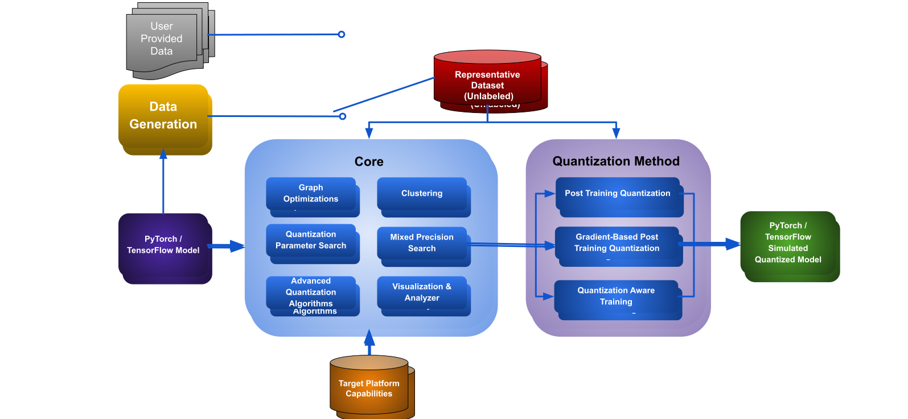
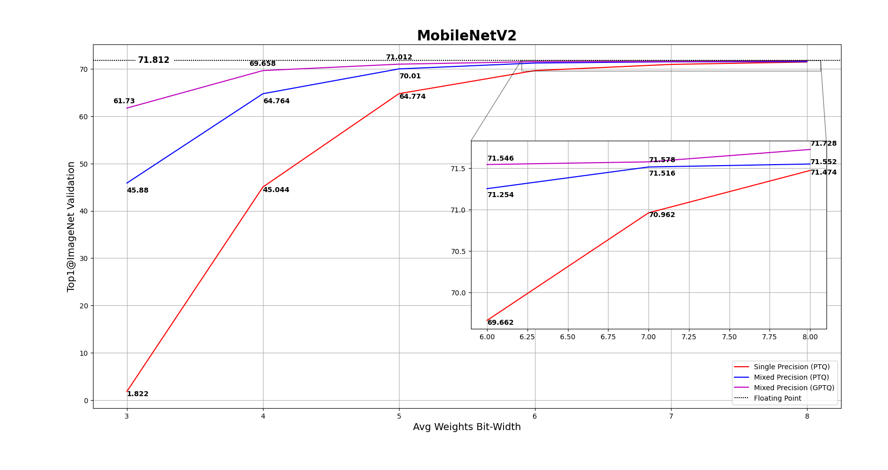

# Model Compression Toolkit (MCT)

Model Compression Toolkit (MCT) is an open-source project for neural network model optimization under efficient, constrained hardware.

This project provides researchers, developers, and engineers tools for optimizing and deploying state-of-the-art neural networks on efficient hardware.

Specifically, this project aims to apply quantization to compress neural networks.



MCT is developed by researchers and engineers working at Sony Semiconductor Israel.


## Table of Contents

- [Getting Started](#getting-started)
- [Supported features](#supported-features)
- [Results](#results)
- [Contributions](#contributions)
- [License](#license)


## Getting Started

This section provides an installation and a quick starting guide.

### Installation

To install the latest stable release of MCT, run the following command:
```
pip install model-compression-toolkit
```

For installing the nightly version or installing from source, refer to the [installation guide](INSTALLATION.md).


### Quick start & tutorials 

For an example of how to use MCT with TensorFlow or PyTorch on various models and tasks,
check out the [quick-start page](tutorials/quick_start/README.md) and
the [results CSV](tutorials/quick_start/results/model_quantization_results.csv).

In addition, a set of [notebooks](tutorials/notebooks) are provided for an easy start. For example:
* [MobileNet with Tensorflow](tutorials/notebooks/example_keras_mobilenet.py).
* [MobileNetV2 with PyTorch](tutorials/notebooks/example_pytorch_mobilenet_v2.py).
* [Data Generation for ResNet18 with PyTorch](tutorials/notebooks/example_pytorch_data_generation.ipynb).


### Supported Versions

Currently, MCT is being tested on various Python, Pytorch and TensorFlow versions:

|             | PyTorch 1.12                                                                                                                                                                                                                               | PyTorch 1.13                                                                                                                                                                                                                               | PyTorch 2.0                                                                                                                                                                                                              |
|-------------|--------------------------------------------------------------------------------------------------------------------------------------------------------------------------------------------------------------------------------------------|--------------------------------------------------------------------------------------------------------------------------------------------------------------------------------------------------------------------------------------------|--------------------------------------------------------------------------------------------------------------------------------------------------------------------------------------------------------------------------|
| Python 3.8  | [](https://github.com/sony/model_optimization/actions/workflows/run_tests_python38_pytorch112.yml)   | [](https://github.com/sony/model_optimization/actions/workflows/run_tests_python38_pytorch113.yml)   | [](https://github.com/sony/model_optimization/actions/workflows/run_tests_python38_pytorch20.yml)   |
| Python 3.9  | [](https://github.com/sony/model_optimization/actions/workflows/run_tests_python39_pytorch112.yml)   | [](https://github.com/sony/model_optimization/actions/workflows/run_tests_python39_pytorch113.yml)   | [](https://github.com/sony/model_optimization/actions/workflows/run_tests_python39_pytorch20.yml)   |
| Python 3.10 | [](https://github.com/sony/model_optimization/actions/workflows/run_tests_python310_pytorch112.yml) | [](https://github.com/sony/model_optimization/actions/workflows/run_tests_python310_pytorch113.yml) | [](https://github.com/sony/model_optimization/actions/workflows/run_tests_python310_pytorch20.yml) |


|             | TensorFlow 2.11                                                                                                                                                                                                                        | TensorFlow 2.12                                                                                                                                                                                                                        | TensorFlow 2.13                                                                                                                                                                                                                        |
|-------------|----------------------------------------------------------------------------------------------------------------------------------------------------------------------------------------------------------------------------------------|----------------------------------------------------------------------------------------------------------------------------------------------------------------------------------------------------------------------------------------|----------------------------------------------------------------------------------------------------------------------------------------------------------------------------------------------------------------------------------------|
| Python 3.8  | [](https://github.com/sony/model_optimization/actions/workflows/run_tests_python38_keras211.yml)   | [](https://github.com/sony/model_optimization/actions/workflows/run_tests_python38_keras212.yml)   | [](https://github.com/sony/model_optimization/actions/workflows/run_tests_python38_keras213.yml)   |
| Python 3.9  | [](https://github.com/sony/model_optimization/actions/workflows/run_tests_python39_keras211.yml)   | [](https://github.com/sony/model_optimization/actions/workflows/run_tests_python39_keras212.yml)   | [](https://github.com/sony/model_optimization/actions/workflows/run_tests_python39_keras213.yml)   |
| Python 3.10 | [](https://github.com/sony/model_optimization/actions/workflows/run_tests_python310_keras211.yml) | [](https://github.com/sony/model_optimization/actions/workflows/run_tests_python310_keras212.yml) | [](https://github.com/sony/model_optimization/actions/workflows/run_tests_python310_keras213.yml) |


## Supported Features
MCT offers a range of powerful features to optimize neural network models for efficient deployment. These supported features include:

### Data Generation
MCT provides tools for generating synthetic images based on the statistics stored in a model's batch normalization layers. These generated images are valuable for various compression tasks where image data is required, such as quantization and pruning. 
You can customize data generation configurations to suit your specific needs. [Go to the Data Generation page.](model_compression_toolkit/data_generation/README.md)

### Quantization
MCT supports different quantization methods:
* Post-training quantization (PTQ): [Keras API](https://sony.github.io/model_optimization/docs/api/experimental_api_docs/methods/keras_post_training_quantization_experimental.html#ug-keras-post-training-quantization-experimental), [PyTorch API](https://sony.github.io/model_optimization/docs/api/experimental_api_docs/methods/pytorch_post_training_quantization_experimental.html#ug-pytorch-post-training-quantization-experimental)
* Gradient-based post-training quantization (GPTQ): [Keras API](https://sony.github.io/model_optimization/docs/api/experimental_api_docs/methods/keras_gradient_post_training_quantization_experimental.html#ug-keras-gradient-post-training-quantization-experimental), [PyTorch API](https://sony.github.io/model_optimization/docs/api/experimental_api_docs/methods/pytorch_gradient_post_training_quantization_experimental.html#ug-pytorch-gradient-post-training-quantization-experimental)
* Quantization-aware training (QAT)[*](#experimental-features)


| Quantization Method                           | Complexity | Computational Cost          |
|-----------------------------------------------|------------|-----------------------------|
| PTQ                                           | Low        | Low (order of minutes)      |
| GPTQ (parameters fine-tuning using gradients) | Mild       | Mild (order of 2-3 hours)   |
| QAT                                           | High       | High (order of 12-36 hours) |


In addition, MCT supports different quantization schemes for quantizing weights and activations:

* Power-Of-Two (hardware-friendly quantization [1])
* Symmetric
* Uniform

Main features:
* <ins>Graph optimizations:</ins> Transforming the model to an equivalent (yet, more efficient) model (for example, batch-normalization layer folding to its preceding linear layer).
* <ins>Quantization parameter search:</ins> Different methods can be used to minimize the expected added quantization-noise during thresholds search (by default, we use Mean-Square-Error, but other metrics can be used such as No-Clipping, Mean-Average-Error, and more).
* <ins>Advanced quantization algorithms:</ins> To prevent a performance degradation some algorithms are applied such as: 
  * <ins>Shift negative correction:</ins> Symmetric activation quantization can hurt the model's performance when some layers output both negative and positive activations, but their range is asymmetric. For more details please visit [1].
  * <ins>Outliers filtering:</ins> Computing z-score for activation statistics to detect and remove outliers.
* <ins>Clustering:</ins> Using non-uniform quantization grid to quantize the weights and activations to match their distributions.[*](#experimental-features)
* <ins>Mixed-precision search:</ins> Assigning quantization bit-width per layer (for weights/activations), based on the layer's sensitivity to different bit-widths.
* <ins>Visualization:</ins> You can use TensorBoard to observe useful information for troubleshooting the quantized model's performance (for example, the model in different phases of the quantization, collected statistics, similarity between layers of the float and quantized model and bit-width configuration for mixed-precision quantization). For more details, please read the [visualization documentation](https://sony.github.io/model_optimization/docs/guidelines/visualization.html).   
* <ins>Target Platform Capabilities:</ins> The Target Platform Capabilities (TPC) describes the target platform (an edge device with dedicated hardware). For more details, please read the [TPC README](model_compression_toolkit/target_platform_capabilities/README.md).   

### Enhanced Post-Training Quantization (EPTQ)
As part of the GPTQ we provide an advanced optimization algorithm called EPTQ.

The specifications of the algorithm are detailed in the paper: _"**EPTQ: Enhanced Post-Training Quantization via Label-Free Hessian**"_ [4].

More details on the how to use EPTQ via MCT can be found in the [EPTQ guidelines](model_compression_toolkit/gptq/README.md).


#### Experimental features 

Some features are experimental and subject to future changes. 
 
For more details, we highly recommend visiting our project website where experimental features are mentioned as experimental.


## Results
### Keras
Graph of [MobileNetV2](https://keras.io/api/applications/mobilenet/) accuracy on ImageNet vs average bit-width of weights, using 
single-precision quantization, mixed-precision quantization, and mixed-precision quantization with GPTQ.



For more results, please see [1]

### Pytorch
We quantized classification networks from the torchvision library. 
In the following table we present the ImageNet validation results for these models:

| Network Name              | Float Accuracy  | 8Bit Accuracy   | Data-Free 8Bit Accuracy |
|---------------------------|-----------------|-----------------|-------------------------|
| MobileNet V2 [3]          | 71.886          | 71.444          |71.29|
| ResNet-18 [3]             | 69.86           | 69.63           |69.53|
| SqueezeNet 1.1 [3]        | 58.128          | 57.678          ||

For more results, please refer to [quick start](https://github.com/sony/model_optimization/tree/main/tutorials/quick_start).

## Contributions
MCT aims at keeping a more up-to-date fork and welcomes contributions from anyone.

*You will find more information about contributions in the [Contribution guide](CONTRIBUTING.md).


## License
[Apache License 2.0](LICENSE.md).

## References 

[1] Habi, H.V., Peretz, R., Cohen, E., Dikstein, L., Dror, O., Diamant, I., Jennings, R.H. and Netzer, A., 2021. [HPTQ: Hardware-Friendly Post Training Quantization. arXiv preprint](https://arxiv.org/abs/2109.09113).

[2] [MobilNet](https://keras.io/api/applications/mobilenet/#mobilenet-function) from Keras applications.

[3] [TORCHVISION.MODELS](https://pytorch.org/vision/stable/models.html) 

[4] Gordon, O., Habi, H. V., & Netzer, A., 2023. [EPTQ: Enhanced Post-Training Quantization via Label-Free Hessian. arXiv preprint](https://arxiv.org/abs/2309.11531)