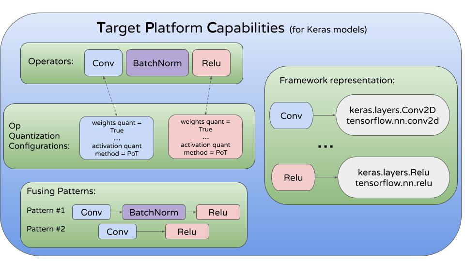

# Target Platform Capabilities (TPC)

## About 

TPC is our way to describe the
hardware that will be used to run and infer with models that are
optimized using the MCT.

The TPC includes different parameters that are relevant to the
 hardware during inference (e.g., number of bits that are used
in some operator for its weights/activations, fusing patterns, etc.)

The two main components of the TPC are the [TargetPlatformModel](https://sony.github.io/model_optimization/api/experimental_api_docs/modules/target_platform.html#targetplatformmodel)
which describes the hardware and the operators it supports, and the [OperationsSetToLayers](https://sony.github.io/model_optimization/api/experimental_api_docs/modules/target_platform.html#operationssettolayers) which
maps the above-mentioned operators to their framework representation.

In addition, each operator can be associated with a quantization configuration
to determine the MCT quantization process for the operator. Also, the operators 
can be used to create fusing patterns in order to treat this list of operators 
as a single operator.

The main components of the TPC are displayed in the next figure:

## Supported TargetPlatformModels 

Currently, there are three TargetPlatformModels in MCT that can be used
(new TargetPlatformModels can be created and used by users):
- Default
- [TFLite](https://www.tensorflow.org/lite/performance/quantization_spec)
- [QNNPACK](https://github.com/pytorch/QNNPACK)

The default model quantizes operators using 8 bits with power-of-two thresholds.
For mixed-precision quantization it uses either 2, 4 or 8 bits for quantizing the operators.
The entire default model and its parameters can be viewed [here](https://github.com/sony/model_optimization/blob/main/model_compression_toolkit/core/tpc_models/default_tpc/v3/tp_model.py).

TFLite and QNNPACK models were created based on TensorFlow and PyTorch code.

After creating a TargetPlatformCapabilities object, you can pass it to the MCT when
compressing a model and the model will be optimized according to the TPC.

For more information and examples, we highly recommend you to visit our [project website](https://sony.github.io/model_optimization/api/experimental_api_docs/modules/target_platform.html#ug-target-platform).

