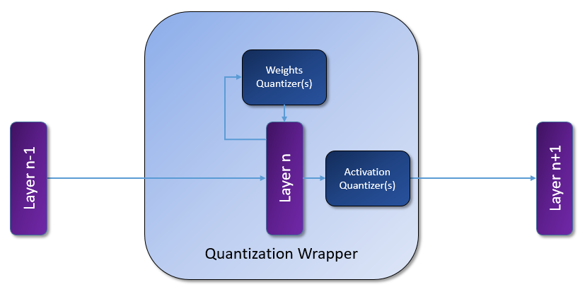

# Quantizers Infrastructure (QI)

Quantizers infrastructure is a module containing quantization abstraction and quantizers for hardware-oriented model optimization tools such as the Model Compression Toolkit ([MCT](https://github.com/sony/model_optimization)).

It provides the required abstraction for emulating inference-time quantization and trainable quantization methods such as quantization-aware training.

## High level description

For each layer, we use a "Quantization Wrapper" to wrap the layer, weights quantizers, and activation quantizers. We can choose the quantizers and all the quantization information for each layer by initializing the weights_quantizer and activation_quantizer API.

Notice that the quantization wrapper and the quantizers are per framework.

## Quantizers 
The quantizers in this module are divided into two main types:
The "Inferable Quantizer" is used for emulating inference-time quantization, and the "Trainable Quantizer", contains learnable quantization parameters that can be optimized during training.

## Details and Examples

More details and "how to" examples for TensorFlow can be found in:

[Inferable quantizers for TensorFlow](keras/inferable_quantizers/README.md)

[Trainable quantizers for TensorFlow](keras/README.md)

And for PyTorch:

[Inferable quantizers for PyTorch](pytorch/inferable_quantizers/README.md)

[Trainable quantizers for PyTorch](pytorch/README.md)

  

